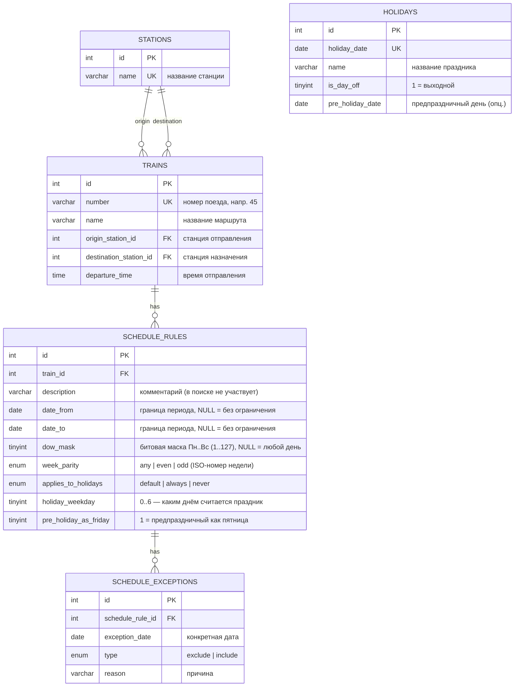

# ER-диаграмма базы данных

## Mermaid (рендерится на GitHub, GitLab, в VS Code и большинстве IDE)



## ASCII-схема (на случай, если mermaid недоступен)

```
┌──────────────┐          ┌──────────────────────────────┐
│  STATIONS    │          │  TRAINS                      │
│──────────────│          │──────────────────────────────│
│ id       PK  │──┐       │ id                    PK     │
│ name     UK  │  │       │ number                UK     │
└──────────────┘  │       │ name                         │
                  ├──────<│ origin_station_id     FK     │
                  │       │ destination_station_id FK    │
                  │       │ departure_time               │
                  │       └───────────────┬──────────────┘
                  │                       │ 1
                  │                       │
                  │                       │ N
                  │       ┌───────────────▼──────────────┐
                  │       │  SCHEDULE_RULES              │
                  │       │──────────────────────────────│
                  │       │ id                    PK     │
                  │       │ train_id              FK     │
                  │       │ description                  │
                  │       │ date_from / date_to          │
                  │       │ dow_mask      (биты Пн..Вс)  │
                  │       │ week_parity   (any/even/odd) │
                  │       │ applies_to_holidays          │
                  │       │ holiday_weekday              │
                  │       │ pre_holiday_as_friday        │
                  │       └───────────────┬──────────────┘
                  │                       │ 1
                  │                       │
                  │                       │ N
                  │       ┌───────────────▼──────────────┐
                  │       │  SCHEDULE_EXCEPTIONS         │
                  │       │──────────────────────────────│
                  │       │ id                    PK     │
                  │       │ schedule_rule_id      FK     │
                  │       │ exception_date               │
                  │       │ type  (exclude / include)    │
                  │       └──────────────────────────────┘
                  │
   (логически      │
    не связана ────┼────┐   ┌──────────────────────────────┐
    внешним FK,    │    │   │  HOLIDAYS                    │
    участвует в    └────┼──>│──────────────────────────────│
    вычислениях)        │   │ id                    PK     │
                        └──>│ holiday_date          UK     │
                            │ name                         │
                            │ is_day_off                   │
                            │ pre_holiday_date             │
                            └──────────────────────────────┘
```

## Пояснения к решению

### Почему правило разложено на поля, а не хранится строкой

Задание запрещает строковый поиск/парсинг: ответ «ходит ли поезд в дату X»
должен давать сам MySQL. Строку `"Пн, Ср"` MySQL сравнивать с датой не умеет,
поэтому правило — это **набор скалярных столбцов**, по которым СУБД работает
напрямую:

| Часть правила из задания        | Где хранится                             |
|--------------------------------|------------------------------------------|
| «все дни недели»               | `dow_mask = 127`                          |
| «рабочие дни»                  | `dow_mask = 31` (биты Пн..Пт)             |
| «выходные»                     | `dow_mask = 96` (биты Сб, Вс)              |
| «понедельник, пятница»         | `dow_mask = 17`                           |
| «чётные воскресенья»           | правило с `dow_mask = 64`, `week_parity='even'` |
| «01.06.2022–31.08.2022, ср, чт»| `date_from`, `date_to`, `dow_mask = 12`   |
| «суббота, кроме 26.03 и 16.04» | `dow_mask = 32` + `schedule_exceptions` (type=`exclude`) |

Правило «Пн, пятница, чётные воскресенья» из примера (поезд №45) — это
**два правила**, объединяемых через OR. Поэтому связь `trains → schedule_rules`
имеет кратность **1:N**: одному поезду соответствует несколько правил.

### `dow_mask` — битовая маска дней недели

```
бит:      6   5   4   3   2   1   0
день:    Вс  Сб  Пт  Чт  Ср  Вт  Пн

все дни         = 1111b = 127
рабочие дни     = 0011111b = 31
выходные        = 1100000b = 96
Пн, Пт          = 0010001b = 17
воскресенье     = 1000000b = 64
```

Проверка попадания дня недели в маску — целиком в SQL:
`((dow_mask >> weekday_index) & 1) = 1`.

### Чётность недели

Считается по **ISO-номеру недели** (`WEEKOFYEAR()`). Для «чётных воскресений»
правило задаётся как `dow_mask = 64 (вс)` + `week_parity = 'even'`; в SQL
условие `WEEKOFYEAR(date) % 2 = 0`.

### Праздники и предпраздничные дни

* `holidays.is_day_off = 1` — праздник является выходным.
* **Праздник = выходной.** В правиле поезда это регулирует
  `applies_to_holidays`:
  * `default` — праздник трактуется как выходной (день недели праздника
    задаётся `holiday_weekday`, по умолчанию воскресенье);
  * `never` — поезд, который ходит по выходным, в праздник всё равно не едет;
  * `always` — поезд ходит и в праздничный день.
* **Предпраздничный день = пятница.** День перед праздником (`is_day_off = 1`)
  приравнивается к пятнице, если в правиле `pre_holiday_as_friday = 1`.
  Предпраздничный день либо задаётся явно (`holidays.pre_holiday_date`), либо
  вычисляется автоматически функцией `is_pre_holiday()`: это рабочий день,
  следующий рабочий день после которого — праздник (с пропуском выходных).

### Где живёт логика

Вся логика вычисления «ходит/не ходит» — в хранимых функциях `db/schema.sql`:

```
train_runs_on_date(train_id, date)   -- главная точка входа
  ├── учитывает schedule_exceptions (include / exclude) — наивысший приоритет
  ├── OR по всем правилам поезда
  └── rule_matches_date(rule_id, date)
        ├── holiday_is_day_off()      -> праздник = выходной
        ├── is_pre_holiday()          -> предпраздничный = пятница
        ├── effective_weekday()       -> эффективный день недели
        ├── период date_from..date_to
        ├── бит в dow_mask
        └── week_parity по WEEKOFYEAR()
```

PHP лишь подставляет параметры в `WHERE train_runs_on_date(t.id, :date) = 1`
и рендерит результат — никакого разбора строк.
